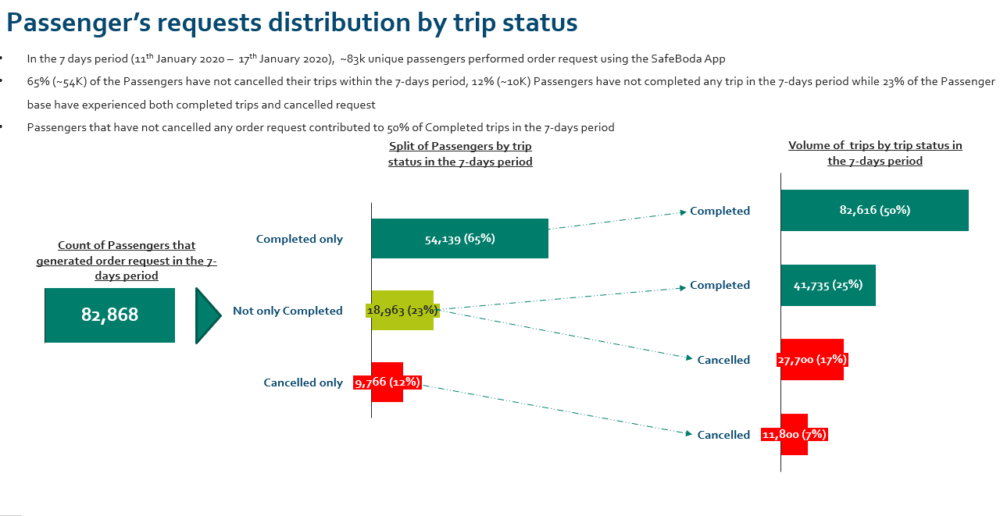
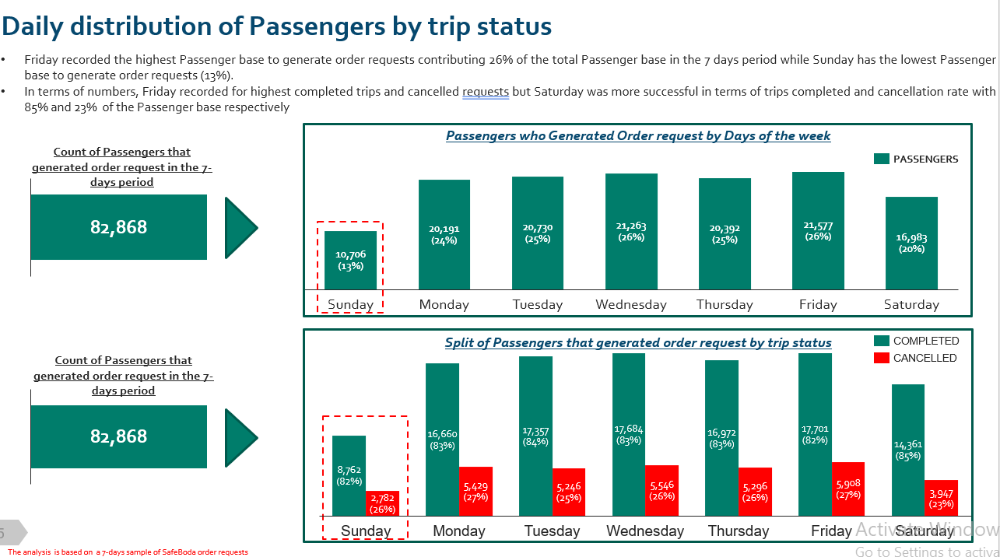

# SafeBoda-Analysis
The SafeBoda Analysis was performed to know the reason for the high ride cancellation.

This analysis was carried out within a 7-days period, were ~83k unique passengers performed their request using SafeBoda App. 65% of the passengers have completed their trip, 23% of the passengers have both completed and cancelled their trip, while the remaining 12% of the passengers do not complete their trip.

From the analysis we are able to see that Friday recorded both thr highest number of passenger's ride order and cancellations.