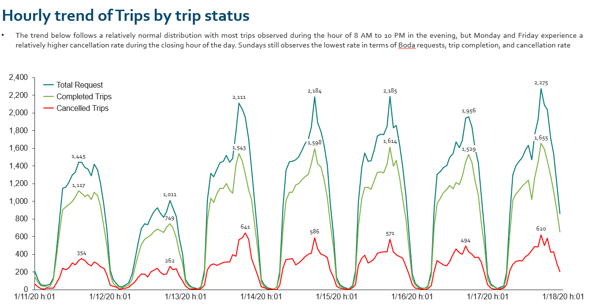

# SafeBoda-Analysis
The SafeBoda Analysis was performed to know the reason for the high ride cancellation.

This analysis was carried out within a 7-days period, were ~83k unique passengers performed their request using SafeBoda App. 65% of the passengers have completed their trip, 23% of the passengers have both completed and cancelled their trip, while the remaining 12% of the passengers do not complete their trip.

From the analysis we are able to see that Friday recorded both the highest number of passenger's ride order and cancellations.

It can also be seen that Central Subcounty has the largest percentage of passengers that made ride orders and likewise also have the largest percentage of passengers with cancelled request.

96% of the passengers reordered after 10min of their ride cancellation, while 4% did not reordered.

Driver with driver id 791284 has the highest trip completion rate, while driver with driver id 169264 has the highest completion and cancelled rate. 

Within the 7days trasacting analysis carried out, 76% completed trip and 24% cancelled trip analysis was observed.

This is an hourly dristribution of the trip from 8am to 10pm in the evening with Monday and Friday recording the highest cancellation rate towards the evening period.

During the 7 days analysis periods, SaeBoda recorded 17 unique suscounty and 150 parishes as area of the ride business.